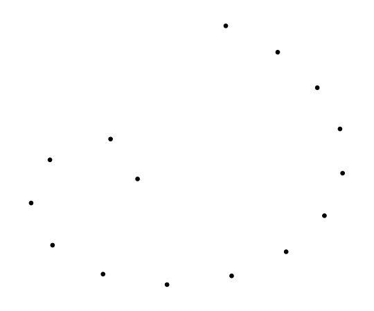
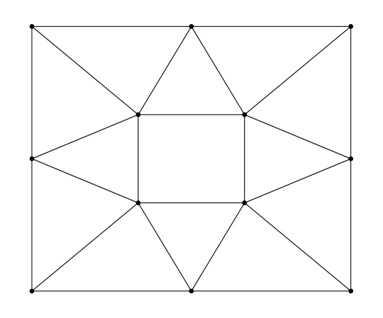

# Examples

Let's say we want a Delaunay triangulation of the following spiral.



To do taht, we create a file with .node extension (for eample [spiral.node](assets/files/spiral.node)), that represents the spiral. We can now compute a Delaunay triangulation of the spiral and generate it's graph.

```julia
using CTriangle

t = triangulate("spiral.node")
outputGraph(t, "/home/martin/spiral")
```

Run the following command form command line if you want to see the graph. It will store a "triangulation.pdf" in the current working directory.

```bash
pdflatex /home/martin/spiral/triangulation.tex
```

The graph from the example above:


Next example shows how we can refine an existing mesh. Let's say we have the mesh stored in [box.node](assets/files/box.node) and [ele.node](assets/files/ele.node).
The following image shows the mesh.



Now imagine that we want one particular triangle to have area not bigger than 0.2. For this we create [box.area](assets/files/box.area) file. Now it can be refined in CTriangle:

```julia
using CTriangle

t = triangulate("box", "ra")
outputGraph(t, "/home/martin/example2")
```
Note that we dont have to specify file extension. CTriangle knows which files to read from the command line switches. The refined mesh is shown on the image below.


